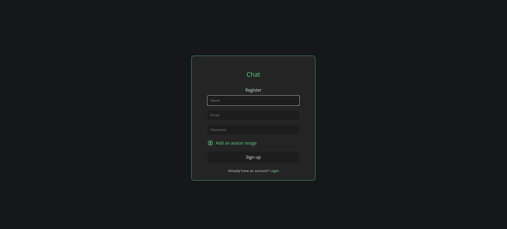
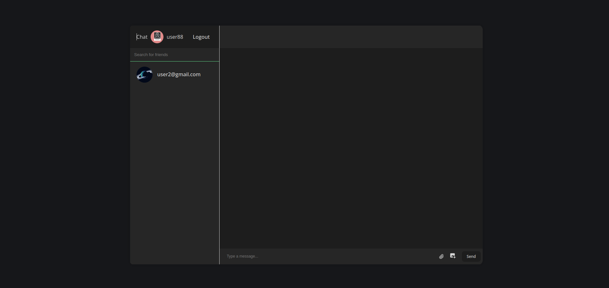

# ChatApp

### Realtime Chat.

A real-time chat application is a digital platform that enables users to engage in instant messaging conversations with one another.

## [💻 Click here to see the live project!](https://chatapp.host/)

### [Link to GitHub](https://github.com/Candangueira/ChatApp)

# 📄 About

How to use the Chat.

1.  Register.
2.  Search for friends in the chat room.
3.  Send messages to them!

## 📷 Screenshots

**Register page:**

**Login Listings:**

**Chat Details:**

# 😱 Bugs to fix 💩

-   Make the website responsive.
-   Sometimes the user can't send images.

## 🚀 Cool tech

-   React
-   Firebase
-   Javascript
-   HTML and CSS for frontend styling

🚀 Next Steps

-   Send emojis, files.
-   Allow videocalls.
-   Enable users to delete and update messages.

